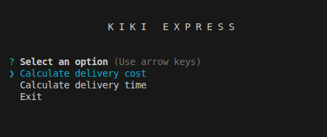
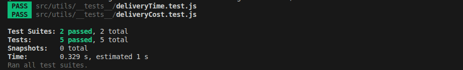

# K I K I  E X P R E S S - Coding Challenge

A CLI application to calculate delivery cost and estimated delivery times for packages based on **weight**, **distance**, **offers** and **vehicle information**.

## Core Functionality
The application supports two main use cases:
1. **Delivery Cost Calculation**: Calculate delivery cost per package and applies discount for valid offers.
2. **Delivery Time Calculation**: Selects the best vehicle for each package to complete deliveries as quickly as possible.

## How to Run the Project
1. Install Dependencies:
   ```
   npm install
   ```
2. Start Application:
   ```
   npm start
   ```
3. Run tests:
   ```
   npm test
   ```

## Features
1. **Delivery Cost Calculation**
   - Delivery Cost
    ```
    Base Delivery Cost + (Package Total Weight * 10) + (Distance to Destination * 5)
    ```
   - **Discounts** : Applied only when the offer code is valid. You can view the available offer codes in `src/config/offers.js`

2. **Delivery Time Calculation**
     - Finds the best set of packages a vehicle can carry in one trip without exceeding its weight limit.
     - Estimates delivery times considering multiple vehicles can work at the same time and must return to base between trips.

## Technical Choices
1. Stack
   - **Node.js**
   - **inquirer** - Used for a better interactive CLI experience.
   - **Jest** - Unit testing

2. Algorithm Design
   - A **backtracking** approach is used to finds the best set of packages a vehicle can carry in a single trip.
   - **Rules**:
     - Maximize number of packages per trip
     - Maximize total batch weight
     - Stay within vehicle weight limit

## Testing
Unit tests are written using **Jest** to validate basic logic, Including:
   - Cost calculation
   - Discounts
   - Delivery Scheduling Time
     
## Folder Structure
```
src
  assets                    
    package.js             - Contains the Package Model.
  calculations
    deliveryCost.js        - CLI flow for calculating the delivery cost
    deliveryTime.js        - CLI flow for calculating the delivery time
  config
    offers.js              - Offer rules
  utils
    service.js             - Core business logic
    helper.js              - helpers and Output formatting
    validate.js            - input validation functions
    __tests__              - Unit tests
index.js                   - Application entry point
```

## KIKI EXPRESS CLI – First Look


## Demo

## Tests


